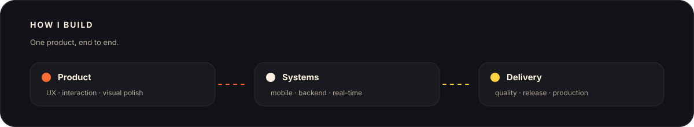
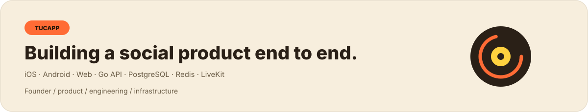

## About

I'm **Walker**, a **full-stack developer and product builder** working across product, mobile, backend, real-time systems and production infrastructure.

I care about software that feels intentional: clear interfaces, dependable systems, and releases that hold up on real devices.

## What I work with

<table><tr><td width="50%" valign="top"><b>Frontend & Mobile</b>  React Native · Expo · React · TypeScript Responsive UI · Cross-platform architecture · Native releases</td><td width="50%" valign="top"><b>Backend & Data</b>  Go · REST APIs · PostgreSQL · Redis Authentication · API design · Production architecture</td></tr><tr><td width="50%" valign="top"><b>Real-time</b>  LiveKit · WebRTC · Messaging · Push notifications Voice features · Presence · Social interaction systems</td><td width="50%" valign="top"><b>Infrastructure & Quality</b>  Vercel · Neon · Cloudflare R2 · OVH / Coolify CI · Validation · Security hardening · Release reliability</td></tr></table>

## Core stack

## Featured build

Founder & Full-Stack Developer · @klf249

