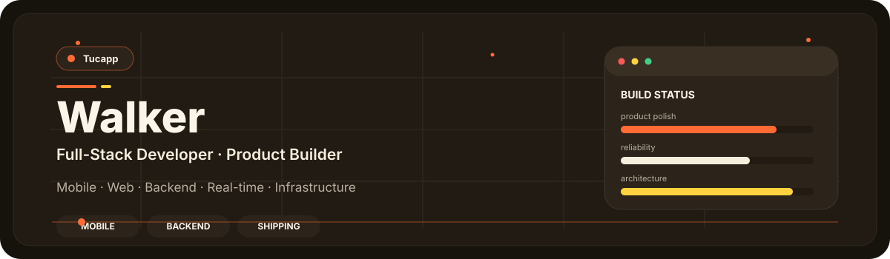
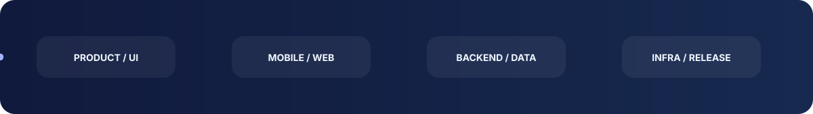
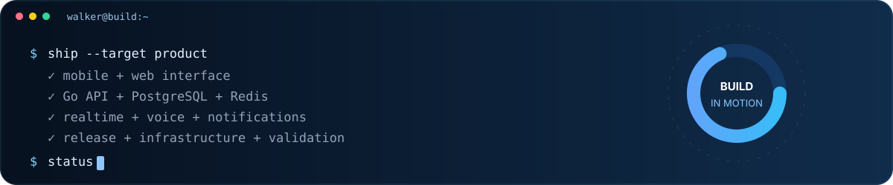
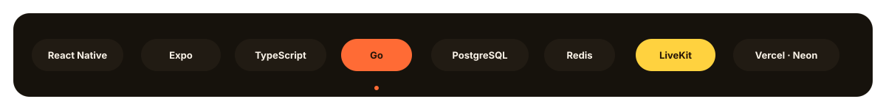
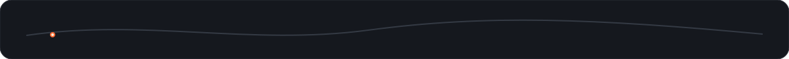

 

## About

I'm **Walker**, a **full-stack developer and product builder**. I build products end to end — interface, mobile, backend, real-time systems, infrastructure and release quality.

My main project is **Tucapp**, where I focus on making the product feel coherent from the first interaction all the way to production.

## Build loop

## What I work with

<table>
<tr>
<td width="50%" valign="top">

**Frontend & Mobile**  
React Native · Expo · React · TypeScript  
Responsive UI · Cross-platform architecture · Native releases

</td>
<td width="50%" valign="top">

**Backend & Data**  
Go · REST APIs · PostgreSQL · Redis  
Authentication · API design · Production architecture

</td>
</tr>
<tr>
<td width="50%" valign="top">

**Real-time**  
LiveKit · WebRTC · Messaging · Push notifications  
Voice · Presence · Social interaction systems

</td>
<td width="50%" valign="top">

**Infrastructure & Quality**  
Vercel · Neon · Cloudflare R2 · OVH / Coolify  
CI · Security hardening · Release reliability

</td>
</tr>
</table>

## Stack

## Currently building

**Tucapp** — a cross-platform social product for **iOS, Android and the web**.  
Current focus: **product polish · real-device reliability · backend clarity · release quality**.

Founder & Full-Stack Developer · @klf249

